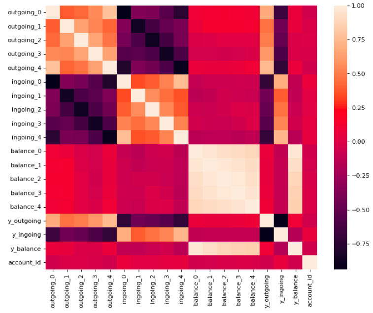

<h1 align="center">Mansa's data science technical test</h1>
<p align="center">El Mahdi L'KOTBI</b></p>

# Introduction

The aim of this technical test is to first build a machine learning model that is able to predict next month outgoing given the past 6 months of transactions of a given account, and then deploy it using FastAPI.

# Remarks
- I have added the possibility to run the setup (server + test) as docker containers, if you wish to use it, make sure to install docker
- Python version : 3.6.9
- Docker version : 20.10.7
- Docker-compose version : 1.29.2

NB : in case of problems installing docker compose, run the following command : 
```pip3 install --upgrade --force-reinstall --no-cache-dir docker-compose && ln -sf /usr/local/bin/docker-compose /usr/bin/docker-compose```

# Usage
- Run ```make server``` in order to run the server as a standalone
- Run ```make test``` in order to run the test script (the server needs to be on)
- Run ```make compose``` in order to run docker-composer pipeline (run server container -> run test container)

# Mythology
## Data science part

Here is the data processing pipeline that i've applied to the original data (transactions.csv, account.csv) : 
- Removing duplicates (A duplicate in this case are two rows with exactly the same values)
- Conserving only account ids with more than 180 days of history
- Feature engineering : outgoing_0, outgoing_1,	outgoing_2,	outgoing_3,	outgoing_4,	ingoing_0,	ingoing_1,	ingoing_2,	ingoing_3,	ingoing_4,	balance_0,	balance_1,	balance_2,	balance_3,	balance_4 (I took only 5 months of history for training in order to keep the 6th month for the target variable calculation)


- I used the XGboost Regression model with Bayesian optimization for the hyper parameters, here are the metrics on the test data : 

explained_variance_score 0.9815143216193105
mean_absolute_error 541.7654876333748
squared_mean_squared_error 1436.3253874883846
r2_score 0.9814954812671071


I have based my analysis on this hypothesis : 1 month is a 30 days period.


 
### Improvements
- Research on the best approachs to forecast an account's outgoings (feature ideas, model types, ensembling...)
- Create more features in order to capture insights about the accounts having more than 6 months of history (avg/std balance/outgoing...)
- Research on the best approachs to handle sparse timeseries


## Data engineering part
Here are the changes I applied to the original repository's architecture : 
- Separating python scripts into src/test, adding a folder for binary files
- Transforming the code logic to be OOP friendly
- Adding tests with real data extracted from the original data
- Dockerizing the server component and the test component
- Adding a makefile to make life easier

### Improvements
- Adding more automation/monitoring to the RegressionModel class (training a new model, validation, params/metrics logging...)
- Using a better format for saving the model (PMML, ONNX...)
- Adding throughput analysis script in order to evaluate the server's capacity
